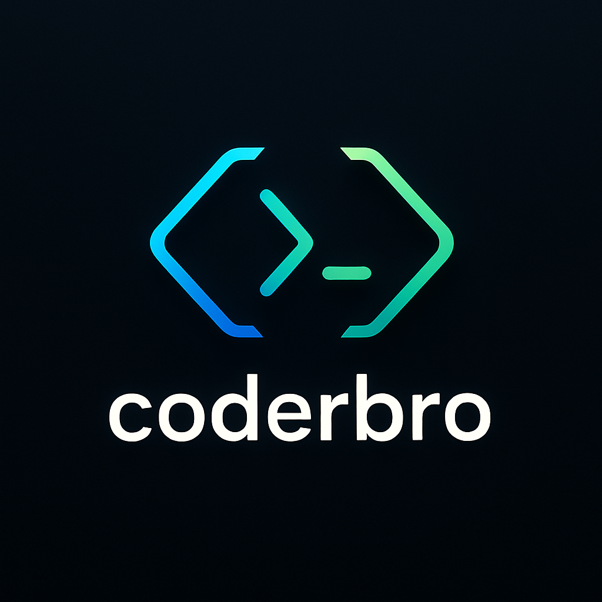

# 📂 Open Gist Folder by ID — VS Code Extension

  
  

> 📦 **Version**: `v0.0.3` – Now with AI Summarizer (OpenAI & Gemini), Fork & Star Gist, Image Paster, Scratch Notes, Playground Mode and more!

---

## ✨ Features

✅ Open a GitHub Gist **as a folder**, preserving nested structure using filenames  
✅ Create public or private Gists directly from any file  
✅ Add individual files or full folders to an existing Gist  
✅ Delete specific files or the entire Gist  
✅ Flatten folder paths using `...` so Gist can simulate subfolders  
✅ Built-in GitHub token authentication with validation  
✅ Tokens are stored securely using VS Code's SecretStorage  
✅ Works behind firewalls and proxies (no browser dependency)

---

### 🆕 v0.0.3 — Power-Boosted Features

| Feature | Description |
|--------|-------------|
| 🤖 **AI Summarizer (OpenAI & Gemini)** | Choose between OpenAI or Google Gemini to summarize code (No keys are stored) |
| 🔁 **Auto-Sync Toggle** | Enable or disable syncing Gist updates on save |
| ⭐ **Star / Unstar Gist** | Mark Gists as favorite and manage them |
| 🍴 **Fork Gist** | Instantly create a forked version of a Gist |
| 🧷 **Scratch Notes** | Create markdown notes directly saved to a personal Gist |
| 🖼️ **Paste Image to Gist** | Paste image as file (markdown / base64 supported) |
| 🧪 **Comment Threads** | Basic UI for commenting and viewing threads on files |
| 🌍 **Follow GitHub Users** | Follow and browse public Gists from other GitHub users |
| 🧩 **Code Playground** | Advanced CodeSwing-style environment for experimenting with code live |

---

## 🔐 Setting Up Your GitHub Token

Creating or editing Gists requires authentication. Follow these steps to create and add your **GitHub Personal Access Token**:

### 🔑 How to Create a GitHub Token

1. Go to [https://github.com/settings/tokens](https://github.com/settings/tokens)
2. Click **"Fine-grained tokens"** → then **"Generate new token"**
3. Name your token (e.g., `VS Code Gist`)
4. Set:
   - Expiration: Choose 30 days or "No expiration"
   - Repository access: Doesn't matter for Gists
   - Permissions:
     - Under **Gists**, check ✅ `Read and write`
5. Click **Generate token**
6. **Copy the token** — you won’t see it again!

### 🚀 Adding Token to Extension

1. In VS Code, press `F1`
2. Run `coderbro: Set GitHub Token`
3. Paste the token you created

🔐 Your token is securely saved via VS Code’s SecretStorage.

To remove it:  
`F1` → `coderbro: Clear GitHub Token`

---

## 🛠️ Usage Guide

### 📂 Open Gist by ID

- Run: `coderbro: Open Gist by ID`  
- Paste your Gist ID (e.g., `abcd12345`)  
- It will open as a **folder in VS Code**

➡️ Supports folder-like files: `src...main.cpp` → `src/main.cpp`

---

### ✏️ Create a New Gist

- Open any file  
- Run: `coderbro: Create New Gist`  
- Enter description + choose Public/Private  
- Gist is created and ID is copied to your clipboard

---

### 📁 Upload a Folder to a Gist

- Run: `coderbro: Upload Folder to Gist`  
- Select a folder from your system  
- Enter the target Gist ID  
- All files will be uploaded using `...` to simulate folder paths

---

### ➕ Add File to Gist

- Run: `coderbro: Add File to Gist`  
- Select file → Enter Gist ID → Done!

---

### ➖ Remove File from Gist

- Run: `coderbro: Remove File from Gist`  
- Enter Gist ID and file name (e.g., `src...index.js`)

---

### 🗑️ Delete a Gist

- Run: `coderbro: Delete Gist`  
- Enter Gist ID → Gist is permanently deleted

---

 ### 🤖 AI Summarizer (OpenAI & Gemini)

- Run: `coderbro: Summarize Gist with AI`  
- Select your AI provider (OpenAI or Gemini)  
- The extension uses these optional settings:
  - `open-gist.aiProvider` (default: `openai`)
  - `open-gist.openaiApiKey` (OpenAI users)
  - `open-gist.geminiApiKey` (Gemini users)

💡 Your API key is never saved to disk. For security, it’s used only in memory for the session.

---

### 🔐 How to Get Your API Key

#### 🧠 OpenAI

1. Visit: [https://platform.openai.com/account/api-keys](https://platform.openai.com/account/api-keys)  
2. Log in with your OpenAI account  
3. Click “Create new secret key”  
4. Copy the key (starts with `sk-...`) and paste it when prompted in VS Code

#### 🪄 Gemini (Google AI Studio)

1. Visit: [https://makersuite.google.com/app/apikey](https://makersuite.google.com/app/apikey)  
2. Log in with your Google account  
3. Click “Get API key”  
4. Copy the key (starts with `AIza...`) and paste it when prompted in VS Code

🛡️ For privacy and security, your API keys are only used during the current session — they are never saved to disk.

---

### 🔁 Toggle Auto-Sync

- Run: `coderbro: Toggle Auto Gist Sync`  
- This toggles setting: `open-gist.autoSync` in user preferences

---

### ⭐ Star / 🍴 Fork Gist

- In **Gist Explorer**, right-click a Gist  
- Select `Star Gist`, `Unstar Gist`, or `Fork Gist`  
- Forked Gist opens in a new workspace window

---

### 🧷 Scratch Notes

- Run: `coderbro: Create Scratch Note`  
- Generates a markdown note with timestamp in your scratch Gist

---

### 🖼️ Paste Image into Gist File

- Copy any image (Ctrl+C)  
- Focus on a file inside Gist in editor, press `Ctrl+V`  
- Uploads as:
  - File with markdown reference  
  - OR embedded base64 block, based on config

---

### 🧪 Gist Comment Threads

- Open a Gist file  
- Threads are shown below file  
- Click to expand, reply, or hide comment threads

---

### 🌍 Follow GitHub Users

- Run: `coderbro: Follow GitHub User`  
- Explore public Gists from followed users in **Gist Explorer**

---

### 🧩 Code Playground (Live Preview)

- Run: `coderbro: Create Code Playground`  
- Opens an HTML/CSS/JS/Markdown preview with instant updates  
- Ideal for quick experiments and sharing via Gists

---

## 🎬 Tutorials (Coming Soon)

- 📹 How to create and set a GitHub token  
- 📹 How to upload a folder to a Gist  
- 📹 How to use the AI summarizer and auto-sync  

> 📺 Video links will appear here once available

---

  

## 👨‍💻 Maintained by [@coderbro](https://github.com/coderbro0)

- 🧠 Love the tool? Star it on GitHub!  
- 💬 Issues, suggestions, or feature requests welcome.

---

## 📄 License

Apache License 2.0 © [coderbro](https://github.com/coderbro0)

---

## 📌 Tags & Topics

  
  
  
  
  
  
  
  
  

---

## 🧩 Related Tags (Plain)

`#gist` `#github` `#gist-explorer` `#vscode-extension` `#auto-sync`  
`#openai` `#code-summary` `#cloud-snippets` `#code-sharing` `#developer-tools`  
`#open-gist` `#code-manager` `#ai-powered` `#vscode-gist` `#gist-manager`  
`#gist-sync` `#upload-to-gist` `#gist-folder` `#file-sync` `#vscode-integrations`
